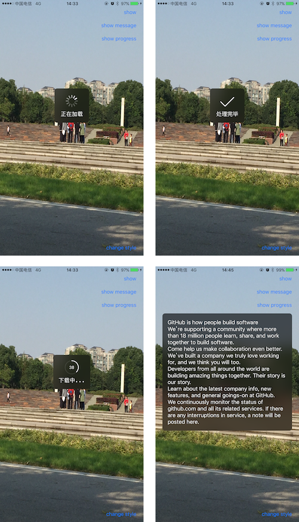

# Chrysan
顾名思义，执行任务时界面上旋转的菊花。

基于 HKProgressHUD 重构，完全遵循了 Swift 3 的 API 风格，适用于 Swift 3.0+，iOS 8.0+

Chrysan 使用 iOS 自带的 UIBlurEffect 效果。




### 安装
通过 CocoaPods 安装：

```ruby
pod 'Chrysan'
```

### 使用
每个 View 都有一个 chrysan 属性，可以获取当前 View 的独立的菊花。只有当第一次访问 chrysan 属性时才会真实地创建 ChrysanView 实例，避免不必要的开销和内存占用。

通过访问 ViewController 的 chrysan 属性，可以访问 ViewController 的根 View 的菊花并自动创建。~~通过 ViewController 创建的菊花会自动设置向上 64 个 pt 的距离位移，以优化视觉效果。~~

#### 显示

```swift
public func show(_ status: Status = .running, message: String? = nil, hideDelay delay: Double = 0)
```
这个方法用来显示一个菊花，各参数说明如下：

***status*** - 显示菊花的状态，属于 Status 枚举类型，可以控制显示不同的状态

```swift
/// 菊花的状态，不同的状态显示不同的icon
    public enum Status {
        /// 无状态，显示纯文字
        case plain
        /// 执行中，显示菊花
        case running
        /// 进度，环形进度条
        case progress
        /// 成功，显示勾
        case succeed
        /// 错误，显示叉
        case error
        /// 自定义，显示自定义的 icon
        case custom
    }
```

***message*** - 显示在图标下方的说明文字，说明文字支持多行文本

***hideDelay*** - 自动隐藏的时间，传入0则表示不自动隐藏

--

#### 显示菊花

```swift
// 由于 show 方法的各个参数都支持默认值
// 因此可以调用所有参数都是默认值的最简形式
// 此时显示一个单纯的不会隐藏的菊花
chrysan.show()

// 显示一个带文字的菊花
chrysan.show(message: "正在处理")
```

#### 显示纯文本

```swift
// 显示纯文字
chrysan.show(.plain, message:"这是一段纯文字")
// 显示纯文字，1 秒后隐藏
chrysan.show(.plain, message:"这是一段纯文字", hideDelay: 1)
```

#### 显示图案

```swift
// 任务完成后给予用户反馈
chrysan.show(.succeed, message: "处理完毕", hideDelay: 1)
// 显示自定义图案
let image = UIImage(named: "myImage")
chrysan.show(customIcon: image, message: "自定义图案", hideDelay: 1)
```

#### 显示任务进度

```swift
// 显示环形的任务进度，会在中心显示进度百分比，progress 取值 0-1
chrysan.show(progress: progress, message: "下载中...")
```

### 自定义样式

Chrysan 支持有限的自定义样式

菊花背景支持 UIBlurEffect 的所有样式

```swift
/// 菊花背景样式，使用系统自带的毛玻璃特效，默认为黑色样式
public var hudStyle = UIBlurEffectStyle.dark
```

菊花使用系统的 UIActivityIndicatorView，支持 UIActivityIndicatorViewStyle 的所有类型，默认为 large white

```swift
public var chrysanStyle = UIActivityIndicatorViewStyle.whiteLarge
```


颜色，影响 icon（不包含菊花）、说明文字、进度条和进度数值的颜色

```swift
/// icon 及文字颜色，默认为白色
public var color = UIColor.white
```

支持自定义图片，图片会被强制转换成 Template 渲染模式，因此必须使用包含 alpha 通道的图片

```swift
/// 自定义的 icon 图片 
public var customIcon: UIImage? = nil
```

弹出 HUD 时，可以设置遮罩以遮住背景的内容，遮罩的颜色可以自定义，默认为全透明

```swift
/// 遮罩颜色，遮挡 UI 的视图层的颜色，默认透明
public var maskColor = UIColor.clear
```

可以自定义 HUD 在视图中央的偏移，以应对某些情况下 HUD 不在中心的情况

```swift
/// 菊花在视图中水平方向上的偏移，默认为正中
public var offsetX: CGFloat = 0
/// 菊花在视图中竖直方向上的偏移，默认为正中
public var offsetY: CGFloat = 0
```

-
更多内容请查看示例以及代码注释。
